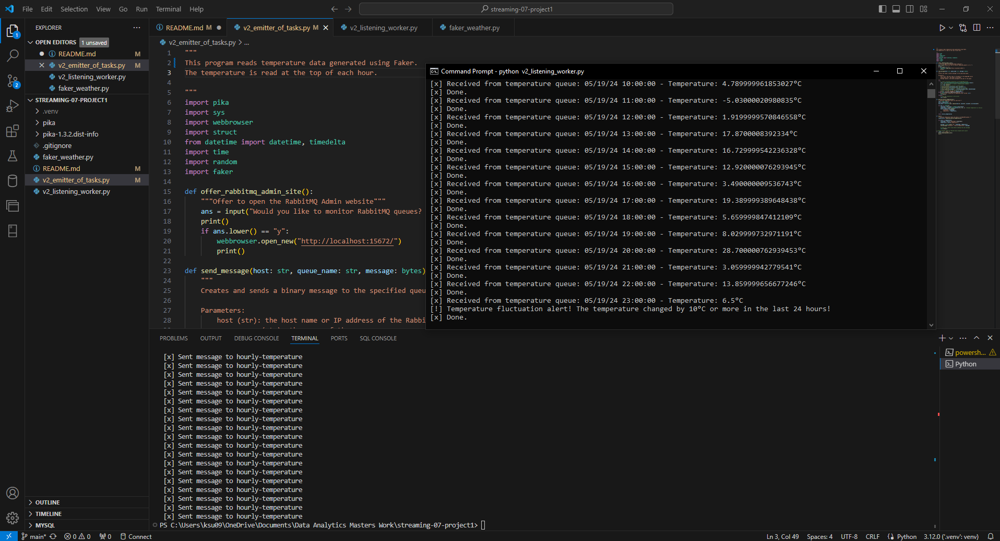

## Tanner Young
# 5/20/2024
# https://github.com/TannerYoung13/streaming-07-project1
# streaming-07-project1

## Real-Time Weather Temperature Monitoring System

# Requirements:
RabbitMQ server running
pika installed in your active environment
RabbitMQ Admin
Faker installe in your active environment

# What:
This project is a real-time streaming analytics system designed to monitor and analyze hourly temperature data. The system simulates the collection of temperature readings over a day and uses RabbitMQ to handle the data flow between producers and consumers. It aims to detect significant temperature fluctuations and provide timely alerts.

# Why:
Real-time monitoring of temperature data is crucial in various domains, including weather forecasting, environmental monitoring, and agricultural management. By implementing this system, we can demonstrate the potential of streaming analytics in processing continuous data flows, identifying patterns, and triggering alerts for significant changes in temperature, which can be critical for decision-making processes.

# Data Sources
The dataset used in this project simulates hourly temperature readings for one day. The temperature data is generated using the Faker library, which provides realistic but randomly generated temperature values.

## Process Description
# Producers:
# Data Generation:
The producer generates temperature data for each hour of the day using the Faker library.
The generated data includes timestamps and temperature values, which are then converted into binary messages.

# Message Sending:
The producer sends these binary messages to a RabbitMQ queue named hourly-temperature.
The messages are sent to the RabbitMQ server running on localhost.
Consumers:

# Message Receiving:
The consumer listens for messages from the hourly-temperature queue.
Upon receiving a message, the consumer unpacks the binary data to retrieve the timestamp and temperature.

# Data Processing:
The consumer stores the received temperature readings in a deque, maintaining a window of the most recent 24 readings.
It checks for significant temperature fluctuations (e.g., a change of 10°C or more in the last 24 hours).
If such a fluctuation is detected, the consumer triggers an alert.

# RabbitMQ Configuration:
# Exchanges and Queues:
This project uses a direct exchange to route messages to the hourly-temperature queue.
The queue is declared as durable to ensure that messages are not lost in case of server failure.
Output Documentation

# Simulation Results:
The producer script successfully generated and sent 24 hourly temperature readings to the hourly-temperature queue.
The consumer script received and processed these messages, storing the temperature readings and monitoring for significant fluctuations.
Sample Output:
 [*] Ready for work. To exit press CTRL+C
 [x] Received from temperature queue: 05/19/24 00:00:00 - Temperature: 12.34°C
 [x] Done.
 [x] Received from temperature queue: 05/19/24 01:00:00 - Temperature: 10.56°C
 [x] Done.
 [x] Received from temperature queue: 05/19/24 02:00:00 - Temperature: 15.78°C
 [x] Done.
 [!] Temperature fluctuation alert! The temperature changed by 10°C or more in the last 24 hours!
...
The consumer printed the received temperature data along with timestamps.
Alerts were triggered when significant temperature fluctuations were detected.

# Links
GitHub Repository: https://github.com/TannerYoung13/streaming-07-project1
Data Source: The temperature data is generated using the Faker library and does not rely on an external data source.

